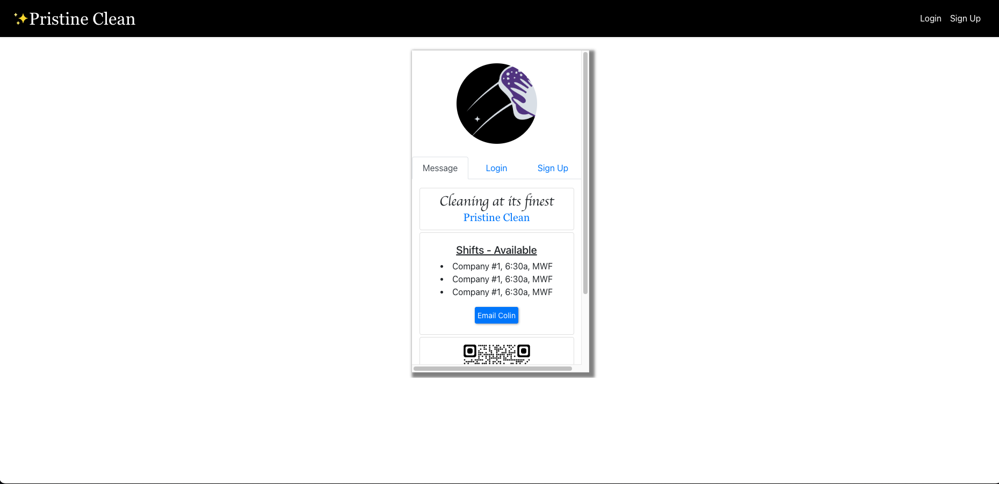

# Integral Solutions

[](https://opensource.org/licenses/MIT)

## Index

1. [Description](#description)
2. [Installation](#installation)
3. [Usage](#usage)
4. [Features](#features)
5. [Technology](#technology)
6. [Contributing](#contributing)
7. [Resources](#resources)
8. [License](#license)

## Description

```
AS the owner of a commercial cleaning business

I WANT employees to be able to log in to an application that gives them all of the tools and information necessary to the requirements of their position.

SO THAT manage the business through a single page application
````

## Usage

This app is deployed using Heroku. From a development perspective, this app uses Node.js, Mongo, React and Apollo/GraphQL. See the technology list below for more detail.

## Features

The following features exist:

1. TBD
2. TBD
3. TBD

## Future Enhancements:

1. TBD
2. TBD
3. TBD

## Technology

1. `React:` JavaScript transcompiler mainly used to convert ECMAScript 2015+ code into a backwards-compatible version of JavaScript.
2. `Git/Github:` Repo and version management.
3. `Mongo/Mongoose`: Database.
4. `React-Bootstrap`: For most of the CSS styling.
5. `Apollo/GraphQL`: For GraphQL database query.
6. `bcrypt`: To encrypt the user password.
7. `jsonwebtoken/jwt decoe`: For user authentication and token decoding.
8. `Heroku`: Deployment.
9. `FullCalendar` npm package.
10. NPM Packages: `FontAwesome`, `moment`, `phone-number-formater`, `react-bootstrap-icons`.
11. `API`: Google maps - a) `places`, b) `directions` and c) `reverse geocode` & d) `TinyURL`.
12. `PWA`: Is intallable as an app via PWA, and works online.

## Website Preview

### Static Screenshots

<!-- [Link to WalkThrough Video](https://drive.google.com/file/d/1w3eswEcDTp-oEddsNW0qHvPi9W9iFht3/view) -->

<!-- [Link to PWA Video](https://drive.google.com/file/d/1rWCGUOQecJ3C8uZmQWN7CETrSV9fm_bZ/view) -->

<!-- [Build & deploy video](https://drive.google.com/file/d/1ZzLVoxGzF3JVj4q5ayudrvb8mLrwxHUR/view) -->

<!--  -->

## Tests

No tests at this time.

## Installation

Setup: 
- (1) Fork the repo, (2) Clone the forked repo locally, (3) Run "npm install" (to install the dependencies).

Setup the Database Schema: 
- (1) Update or add an .env file. Include the fields below in the .env file. Note that the .env variables are used in the conf folder, connection.js file.

  Server-Side '.env`:
  * DB_NAME=integral-solutions

  Client-Side `.env`:
  * REACT_APP_GOOGLE_MAPS_API_KEY=<key>
  * REACT_APP_TINY_URL_KEY=<key>

Seed the Database: 
- Run Server: From the root directory, run either "npm run watch" to start nodemon or "node server.js".
- Seed Database: (a) To create the database, run "SOURCE ./db/schema.sql" in mySQL, (b) To create the database tables, from the terminal, run "npm run start" or "npm run watch", (c) To seed the database tables, run "npm run seed" or "node ./seeds/index.js".

Note that the seed will also create entries for the user table including hashed passwords. When loggin into the app these user seeds can be used as test email address. Either obtain an email address from the user table (SELECT * FROM user;) or use an option noted below:

  * email: a@a.com, password: "12" (note role is employee)
  * email: b@b.com, password: "12" (note role is manager)

If you'd like to use NPM nodemon as/if you make changes to the code, please install nodemon as a development dependency using "npm install --save-dev nodemon" (see https://www.npmjs.com/package//nodemon). 

## Contributing

Contributor Covenant Code of Conduct

[](https://www.contributor-covenant.org/version/2/1/code_of_conduct/code_of_conduct.md)


## Collaborators

1. Rod Bennett GitHub Profile](https://github.com/RodBennett)
2. Bryan Wienhoff GitHub Profile](https://github.com/Hoffalypse)
3. [Steve Calla - GitHub Profile](https://github.com/stevecalla)

## Resources

1. GitHub Repo: <https://github.com/stevecalla/integral-solutions-dev>
3. Heroku Deploy: <https://int-solutions-dev.herokuapp.com/ >

## License

[](https://opensource.org/licenses/MIT)
This project is licensed under the terms of the <span style="color:red">The MIT License</span>. Please click on the license badge for more information.

# integral-solutions-dev
