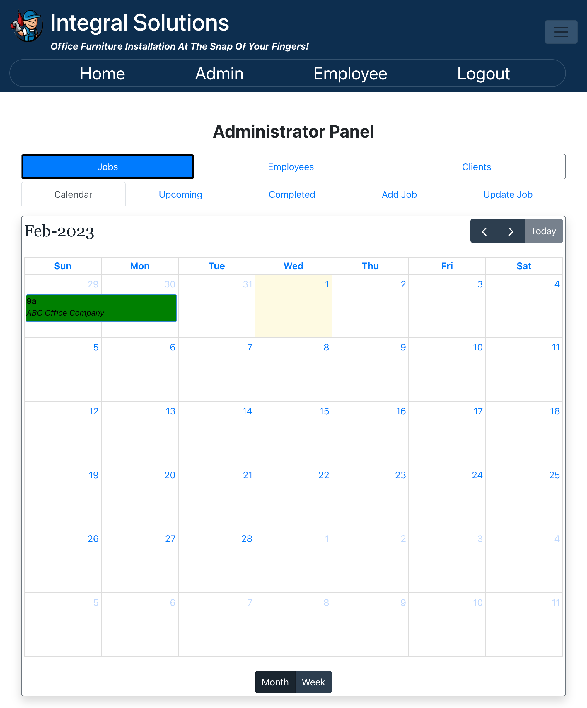
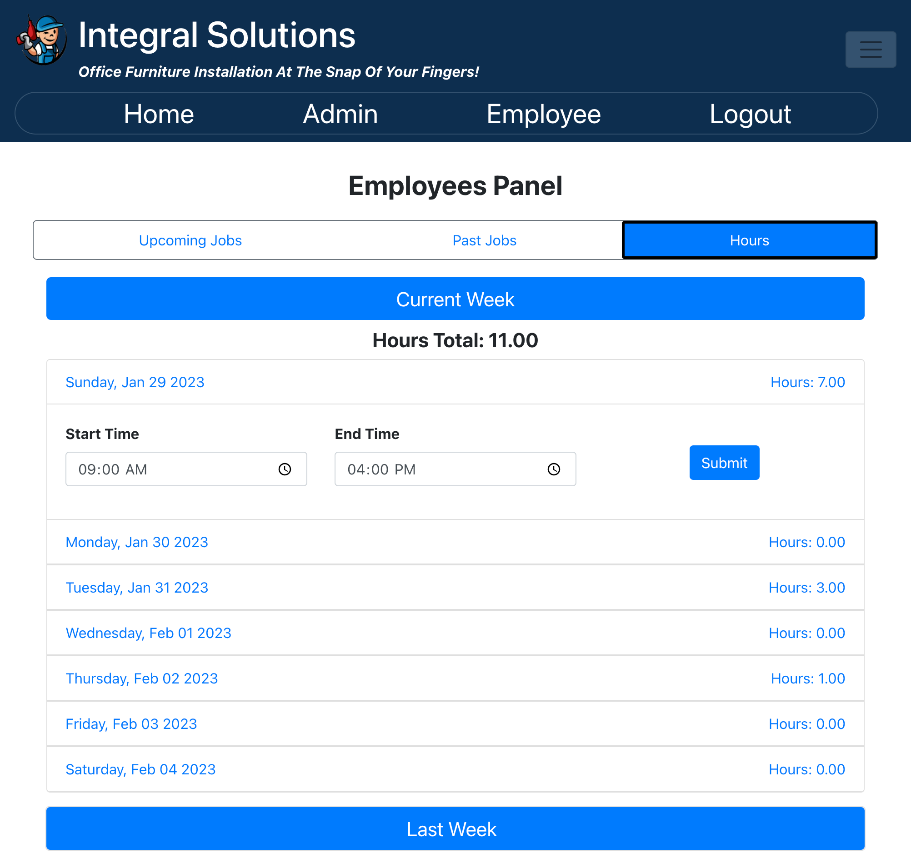

  

## Index

1. [Description](#description)
2. [Installation](#installation)
3. [Usage](#usage)
4. [Features](#features)
5. [Technology](#technology)
6. [Contributing](#contributing)
7. [Resources](#resources)
8. [License](#license)

## Description

MERN app with customer-facing website and employee portal for a furniture installation business.

## Usage

This app is deployed using Heroku. From a development perspective, this app uses Node.js, Mongo, React and Apollo/GraphQL. See the technology list below for more detail.

## Features

The following features exist:

1. Customer facing with home, contact us and partner shopping links pages.
2. Employee login with an administration and employee panel.
3. The administration panel includes functionality to manage clients, jobs and employees with CRUD (Mongo/GraphQL) view, add, update and (soft) delete for all clients, jobs and employees respectively. The employee section includes weekly hours reporting (which was not meant to be a precise time tracking system but a general hours worked feature).
4. The employee panel allows employees to view upcoming and past jobs as well as the ability to enter hours worked for the current week.
5. Additional features include an email server (to serve contact us & password reset via SendGrid), forgot/reset password,  maps links to quickly access a jobs location, 100% mobile responsive, input masks for phone, zip and email, PWA (downloadable as a local app and works online but not offline for the MVP), TinyURL integration and more.

## Technology

1. `React:`
2. `Git/Github:` Repo and version management.
3. `Mongo/Mongoose`: Database.
4. `React-Bootstrap`: For most of the CSS styling.
5. `Apollo/GraphQL`: For GraphQL database query.
7. `jsonwebtoken/jwt decode`: For user authentication and token decoding.
8. `Heroku`: Deployment.
9. `FullCalendar` npm package.
10. NPM Packages: `FontAwesome`, `moment`, `dayjs`,  `phone-number-formater`, `react-bootstrap-icons`, `react-text-mock`, `bcrypt`.
11. `PWA`: Is intallable as an app via PWA, and works online.

## Website Preview

HOME PAGE Screenshot

ADMIN PANEL Screenshot

EMPLOYEE PANEL Screenshot

App WalkThrough Video - TBD
<!-- [Link to WalkThrough Video](https://drive.google.com/file/d/1w3eswEcDTp-oEddsNW0qHvPi9W9iFht3/view) -->

<!--  -->

## Installation

Setup: 
- (1) Fork the repo, (2) Clone the forked repo locally, (3) Run "npm install" (to install the dependencies), (4) Seed = "npm run seed", (5) Launch Server = "npm run develop" (both GraphQL & 3000 local server).

Setup the Database Schema: 
- (1) Update or add an .env file. Include the fields below in the .env file. Note that the .env variables are used in the conf folder, connection.js file.

  Server-Side '.env`:
  * DB_NAME=integral-solutions
  * JWT_SECRET_KEY="<key>"
  * SENDGRID_API_KEY=<key>

  Client-Side `.env`:
  * REACT_APP_TINY_URL_KEY=<key>
  * REACT_APP_DEVELOPMENT_URL=http://localhost:3000
  * REACT_APP_PRODUCTION_URL=<url>

  Heroku Deploy:
  * Install Twillio SendGrip add-in
  * Use all appropriate .env as noted above
  * Add Mongo Atlas path to the config as such mongodb+srv://<username>:<password>@cluster0.x8hemhd.mongodb.net/<database name>?
  * Seed the database in Heroku console using "npm run seed"

Login to The Application: 
* From the home page click "Employee Login" in the lower right hand corner of the footer. Use email address "a@a.com" and password "12345". For all users in the seed "employee" file, the password is consistently "12345". User "a@a.com" has "admin" role and is not locked.
* Once logged in, the nav menu in the header will allow access to the Admin (for users with admin rights) and Employee panel (which is the default for users without admin rights).

Signup (as an employee): 
* Note that signup functionality was eliminated in favor of the admin creating/adding a user/employee. This was to avoid allowing random users from getting access to the employee portal (which could have been accomplished in a variety of ways). Employees can use the password reset functionality once created in the system by the admin to reset their password and get access to the system.

## Contributing

Contributor Covenant Code of Conduct

## Collaborators

1. [Rod Bennett GitHub Profile](https://github.com/RodBennett)
2. [Bryan Wienhoff GitHub Profile](https://github.com/Hoffalypse)
3. [Steve Calla - GitHub Profile](https://github.com/stevecalla)

## Resources

1. GitHub Repo: <https://github.com/20Manny23/integral-solutions>
2. Heroku Deploy: <https://integralofficesolutions.com>

## License

This project is licensed under the terms of the The MIT License. Please click on the license badge for more information.

